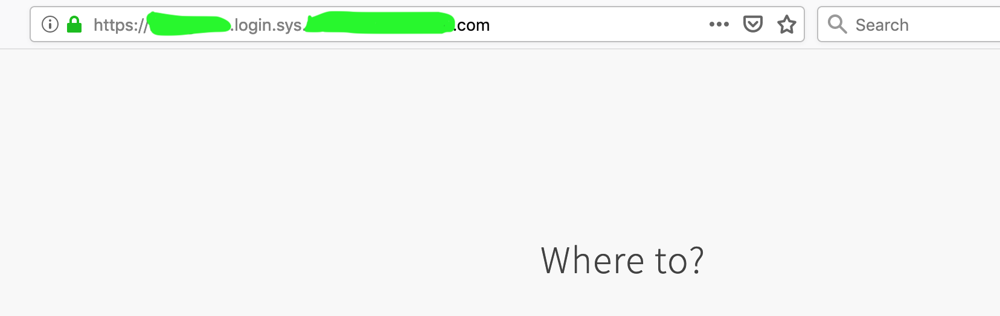

## Issue
redirect_uri uri seems to get dropped during the auth flow and as a result SSO client never receives a call back from UAA. Hence the app request ends at the `where to ?` SSO screen as below

### Failing sample has the below spring/sso specific dependencies, which can also be found from pom.xml

- spring-boot-starter-web - 2.1.8
- spring-boot-starter-oauth2-client - 2.1.8

**Things to consider:**
- This sample application uses the app supplied properties from [application.yml](src/main/resources/application.yml) file to identify/configure it's oAuth2 provider.

Findings so far:
- Changing the oAuth2 `client.registration` to google from uaa in the [application.yml](src/main/resources/application.yml) works as expected and call_back is made to the app after the google auth.
- Client provides the valid redirect (app route) in the original request, and the same is whitelisted.

References:  
[1] https://spring.io/blog/2018/07/30/spring-security-5-1-0-m2-released#ability-to-create-clientregistration-from-oidc-discovery
